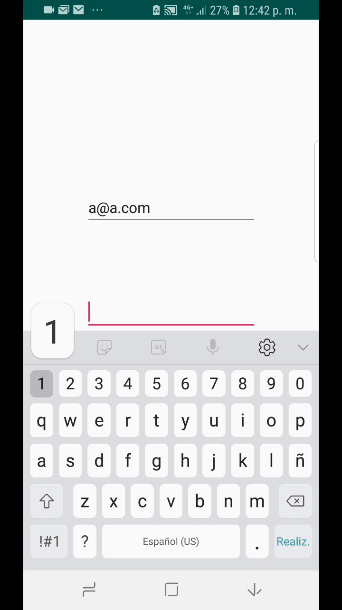

# AndroidAppBundleExample 

Este es un ejemplo del uso de Dynamic Delivery de Android App Bundle, presentado en Google I/O 18.

Este ejemplo es para descargar de manera dinamica features de una aplicacion.

# Pasos para poder compilar la repo
* Compilar.

# Pasos para probar la app con la funcion Dynamic Delivery
* Cambiar el aplicationId.
* Subir la aplicacion a su cuenta de Google Play Console.

# Arquitectura del Proyecto
 

## Kotlin
---
 * Kotlin [1.2.71] - http://kotlinlang.org
 
 ## Libraries
---
 * Dagger2 [2.15] - http://google.github.io/dagger
 * RxFirebase [11.0.4.0] - https://github.com/kunny/RxFirebase
 * RxAndroid [2.0.1] - https://github.com/ReactiveX/RxJava
 * RxKotlin [2.0.3] - https://github.com/ReactiveX/RxJava
 * AndroidThings [1.0] - https://developer.android.com/things/versions/releases (Solo en el branch Things)
 
